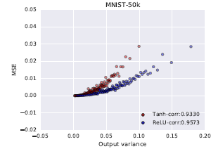
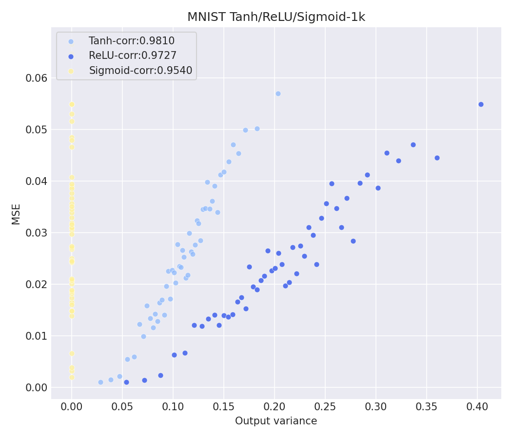
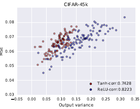
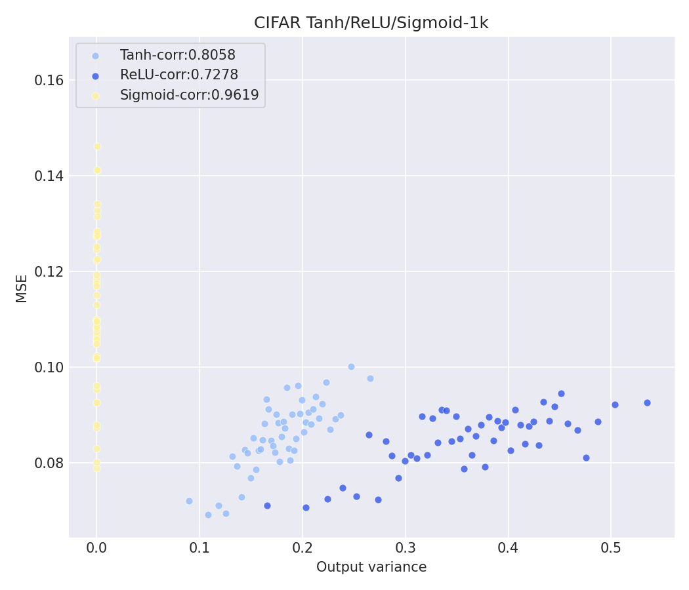

# Reproducing Figure 3 of "Deep Neural Networks as Gaussian Processes" (with sigmoid extension)

STAT 5720 Project 2. Built on the official code release [brain-research/nngp](https://github.com/brain-research/nngp) for Lee, Bahri, Novak, Schoenholz, Pennington & Sohl-Dickstein, *Deep Neural Networks as Gaussian Processes*, ICLR 2018
([arXiv:1711.00165](https://arxiv.org/abs/1711.00165)).

## Target figure

**Figure 3** of the paper: the NNGP's predictive uncertainty (posterior variance, Eq. 9) is highly correlated with its realized test error. The x-axis is the predicted MSE (output variance), the y-axis is the realized MSE, and each point averages 100 test points binned by predicted variance. Hyperparameters: depth = 3, σ_w² = 2.0, σ_b² = 0.2, for Tanh and ReLU, on MNIST and CIFAR-10.

This reproduction adds **sigmoid** as a third nonlinearity on each of the datasets.

### MNIST

| Original (Lee et al., 2018, Figure 3 left) | This reproduction |
|---|---|
|  |  |

### CIFAR-10

| Original (Lee et al., 2018, Fig. 3 right) | This reproduction |
|---|---|
|  |  |

### Correlation between binned predicted variance and binned MSE

| Nonlinearity | Paper MNIST-50k | Ours MNIST-1k | Paper CIFAR-45k | Ours CIFAR-1k |
|---|---|---|---|---|
| Tanh    | 0.9330 | 0.9810 | 0.7428 | 0.8058 |
| ReLU    | 0.9573 | 0.9727 | 0.8223 | 0.7278 |
| Sigmoid | n/a    | 0.9540 | n/a    | 0.9619 |

Both datasets show the same strongly positive relationship between binned predictive variance and binned MSE as the paper, and MNIST again correlates more tightly than CIFAR-10. Three of the four Tanh/ReLU correlations are higher than the paper's, but the Tanh/ReLU ordering is reversed: Tanh edges out ReLU on both datasets here, while the paper has ReLU ahead. With only 50 binned points per curve (5,000 test points rather than 10,000) and a single 1,000-point training sample, these differences are within run-to-run noise. Absolute MSE is higher than in the paper because we train on 1k rather than 50k/45k points.

**Colors differ from the paper on purpose.** The reproduction uses a color-blind-friendly blue/yellow palette (Tanh `#8EB9FC`, ReLU `#274DEA`, Sigmoid `#FFF197`) instead of the paper's red/blue, so all three curves stay distinguishable under red-green color vision deficiency.

## How to reproduce

**Requirements:** Docker (Docker Desktop on Windows/macOS) with at least 4 GB of memory allotted, and an internet connection during the build. Nothing else: no Python, TensorFlow, or datasets on the host.

Additionally, ensure the Docker engine is running before executing the following commands in Powershell/bash.

### Required sequence

```
git clone https://github.com/zuchm/STAT5720-Project-2_NNGP.git
cd STAT5720-Project-2_NNGP
docker build -t nngp-project .
docker run nngp-project
```

- **`docker build`** takes roughly 15–30 minutes the first time. It pulls TensorFlow 1.15, downloads MNIST and CIFAR-10 into the image, and precomputes the sigmoid kernel grid.
- **`docker run`** takes a few minutes. It runs `uncertainty_plot.py` once per dataset and logs `Saved plot to /nngp/output/uncertainty_fig3_mnist.png` and
  `.../uncertainty_fig3_cifar.png`.

### Getting the figures onto your computer

A container has its own filesystem, so the figures are saved **inside the container** at `/nngp/output/`. Docker does not let a container write to your disk unless the `docker run` command grants it a folder. Any of these gets the PNGs out:

**Option A: copy them out after the required sequence**

```
docker cp "$(docker ps -lq):/nngp/output" ./output
```

This works in PowerShell and bash. The figures are then in `./output`.

**Option B: Docker Desktop.** Go to **Containers**, click the most recent `nngp-project` container, and open the **Files** tab. Navigate to `/nngp/output`, right-click a PNG, and choose **Save**.

**Option C: mount a folder so the figures land there directly**

```
# PowerShell
docker run --rm -v "${PWD}\output:/nngp/output" nngp-project

# bash/zsh
docker run --rm -v "$(pwd)/output:/nngp/output" nngp-project
```

### Changing settings

Anything after the image name replaces the default command. For example, to run MNIST only, with the paper's two nonlinearities and all 10,000 test points:

```
docker run --rm -v "${PWD}\output:/nngp/output" nngp-project python uncertainty_plot.py --dataset=mnist --num_train=1000 --num_eval=10000 --hparams=depth=3,weight_var=2.0,bias_var=0.2 --nonlinearities=tanh,relu --output_file=/nngp/output/uncertainty_fig3_mnist.png
```

### What the container does

- **`Dockerfile`**
  - Starts from `tensorflow/tensorflow:1.15.0-py3`.
  - Bakes MNIST and CIFAR-10 into the image, so `docker run` never downloads.
  - Patches the original code at build time:
    - Python 2→3 (`xrange` → `range`).
    - `np.load(..., allow_pickle=True, encoding='latin1')` for the pickled
      kernel grids.
    - Builds the kernel grid one slice at a time, so Docker Desktop doesn't run
      out of memory.
  - Precomputes the sigmoid kernel grid.
  - Runs the script once per dataset.

- **`uncertainty_plot.py`**
  - Builds the NNGP kernel (Eq. 5, via the lookup table of Section 2.5 /
    Eq. 10).
  - Runs exact GP regression (Eqs. 7–9) and plots per-example predictive
    variance against per-example squared error.
  - Sweeps nonlinearities (Tanh, ReLU, Sigmoid), bins by 100, and reports the
    correlation in the legend. The unbinned per-example correlation is printed
    to the log.
  - Comments in the code reference the paper's sections and equations.

## Extension: sigmoid nonlinearity

**What I did.** The paper builds NNGP kernels for  two nonlinearities, Tanh and ReLU (Section 3.1). I added the logistic sigmoid, σ(u) = 1/(1 + e^(−u)), as a third. Because the kernel is computed numerically (Section 2.5, Eq. 10), the model-code change is small: `uncertainty_plot.py` maps the name `sigmoid` to `tf.nn.sigmoid`. The repository ships precomputed kernel lookup tables only for Tanh and ReLU, so the Dockerfile builds the sigmoid table (`grid_data/grid_sigmoid_ng501_ns501_nc500_mv100_mg10`) during `docker build`, using the repository's own grid routine at the same resolution as the shipped tables. I checked that this routine reproduces the shipped Tanh table to about 1e-13. Sigmoid runs with exactly the Figure 3 hyperparameters (depth 3, σ_w² = 2.0, σ_b² = 0.2) and is plotted on the same axes as Tanh
and ReLU.

**Why I chose this extention.** Sigmoid was the standard nonlinearity before ReLU, and it differs from Tanh in one way that matters for the NNGP: it is not zero-centered. Since σ(u) = ½ + ½·tanh(u/2), and odd terms vanish under a zero-mean Gaussian, one step of the kernel recursion (Eq. 5) becomes

K^l = (σ_w²/4)·E[tanh(u/2)·tanh(v/2)] + (σ_b² + σ_w²/4).

Rescaling K by ¼ shows that, apart from the input layer, this is a Tanh NNGP with effective weight variance σ_w²/16 = 0.125 and bias variance (σ_b² + σ_w²/4)/4 = 0.175, with the whole kernel scaled up by 4. That places the sigmoid network deep in the *ordered* phase of the paper's Figure 4a, where Section 3.2 predicts K^l(x, x′) approaches a constant and the GP
struggles to tell inputs apart. The extension therefore tests whether "predictive variance tracks error" still holds for a kernel far from criticality.

**Result.** Sigmoid's binned correlations are high (0.9540 MNIST, 0.9619 CIFAR-10), but its predictive variances are collapsed to nearly zero on both datasets, so its points form a vertical stripe at the left edge of each plot. This follows from the kernel: sigmoid outputs are always positive, so after three layers a shared constant term dominates and nearly every pair of inputs has almost the same covariance. With such a flat kernel the training set almost fully explains each test point, and the posterior variance (Eq. 9) becomes a small difference of nearly equal quantities. 

The unbinned per-example correlations were 0.4403 (MNIST) and 0.3180 (CIFAR-10). Every nonlinearity drops sharply without binning (Tanh 0.4599 / 0.1545, ReLU 0.4340 / 0.1147), since single-example errors are noisy, but sigmoid holds up as well as the others on MNIST and roughly twice as well on CIFAR-10. Its near-zero variances therefore still rank test points by difficulty, even though their absolute scale is not meaningful.

**Conclusion.** For sigmoid, the variance can tell you which test points the model is more likely to get wrong, but the number itself means little. Sigmoid's variances are all close to zero, yet the actual errors range widely, so a sigmoid variance can't be compared to a Tanh or ReLU variance of the same size.

## Known limitations and deviations from the paper

- **Training set size.** 1,000 training points instead of 50,000 (MNIST) / 45,000 (CIFAR-10). A 50k × 50k kernel needs ~20 GB of memory and hours on a laptop CPU. Absolute MSE is therefore higher than in the paper; the paper's Appendix Figure 8 shows the variance–error relationship holds across training set sizes.

- **Test points.** 5,000 instead of 10,000, giving 50 binned points per curve instead of 100. Use `--num_eval=10000` (see "Changing settings") if memory allows.

- **Colors.** A color-blind-friendly palette replaces the paper's red/blue
  (see above).

- **CIFAR-10 loader.** Not in the original repo; added in
  `uncertainty_plot.py` using Keras.
  - It takes the first 1,000 training images, so it is not class-balanced like
    the MNIST loader.
  - It subtracts the per-pixel mean.
  - It zero-centers the one-hot labels (−0.1 / 0.9) as described in
    Section 3.1, matching what the original MNIST loader already does.

- **Observation noise.** As in the released code, no observation noise σ_ε²
  is used, only a small diagonal jitter. The jitter starts at 1e-10 and is
  raised automatically if the Cholesky factorization fails.

- **Grid interpolation.** Kernels come from the precomputed 501 × 501 × 500
  lookup tables of Section 2.5, not analytic formulas, which introduces a small
  interpolation error.

- **Sigmoid.** Not in the paper, so there is no original figure to compare it
  against. Its near-constant kernel may need a larger Cholesky jitter (logged
  if it happens).

## Changes relative to brain-research/nngp

| File | Change |
|---|---|
| `uncertainty_plot.py` | New. Figure 3 reproduction script with sigmoid extension and CIFAR-10 loader |
| `Dockerfile` | New. Reproducible environment, baked datasets and sigmoid grid |
| `.dockerignore` | New. Build-context exclusions |
| `figures/` | New. Paper and reproduction figures for this README |
| `nngp.py`, `gpr.py`, `load_dataset.py`, `interp.py` | Unchanged in the repo; patched only inside the image at build time (see Dockerfile) |

## Citation

```
@article{lee2018deep,
  title={Deep Neural Networks as Gaussian Processes},
  author={Lee, Jaehoon and Bahri, Yasaman and Novak, Roman and Schoenholz, Samuel S. and Pennington, Jeffrey and Sohl-Dickstein, Jascha},
  journal={International Conference on Learning Representations},
  year={2018}
}
```

Original code © Google LLC, Apache 2.0 (see `LICENSE`). This is not an
official Google product.